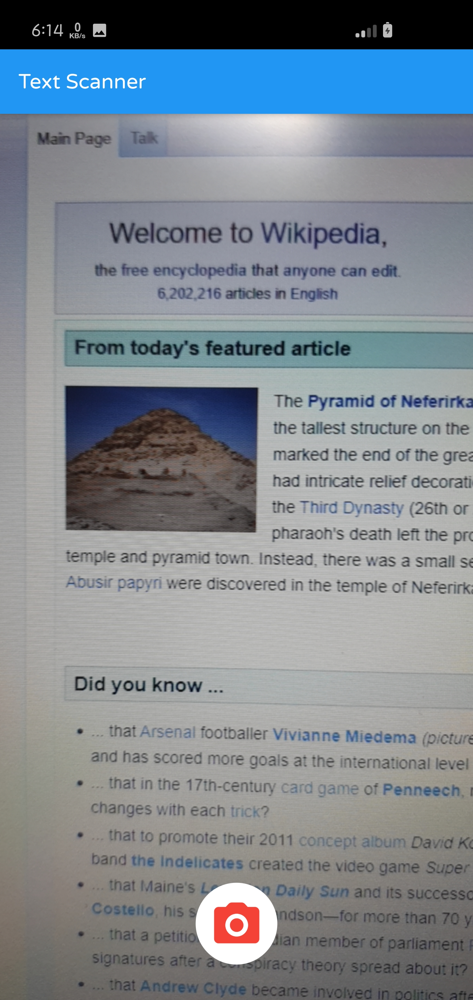
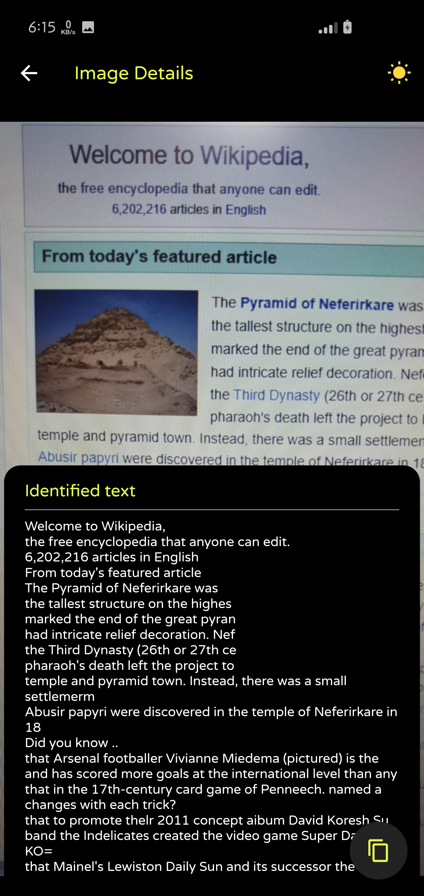
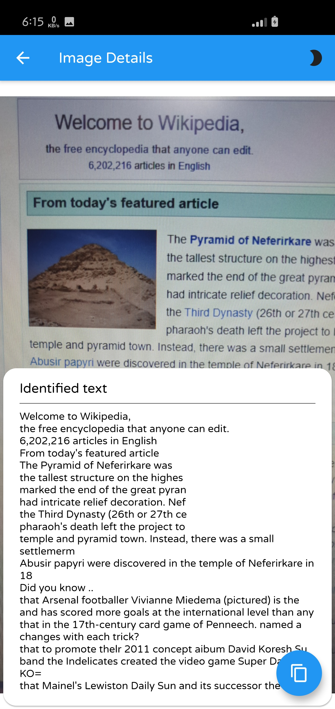

# flutter_vision

A Flutter project.

#### Flutter App Screenshots

<table>
  <tr>
    <td>Camera home page</td>
     <td>Image Details dark mode</td>
     <td>Image Details light mode</td>
  </tr>
  <tr>
    <td></td>
    <td></td>
    <td></td>
  </tr>
 </table>

## Getting Started

This project is a starting point for a Flutter application.

A few resources to get you started if this is your first Flutter project:

- [Lab: Write your first Flutter app](https://flutter.dev/docs/get-started/codelab)
- [Cookbook: Useful Flutter samples](https://flutter.dev/docs/cookbook)

For help getting started with Flutter, view our
[online documentation](https://flutter.dev/docs), which offers tutorials,
samples, guidance on mobile development, and a full API reference.

## Note
This project Firebase ML Toolkit.  
In order to use this app create a new Firebase project from your Firebase console.  
Download the google-services.json file and place it in "projectDirectory/android/app/".

